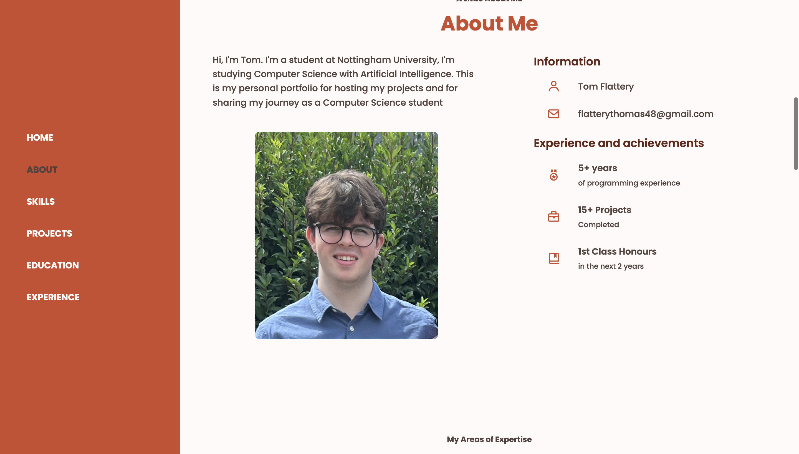

  

<h3 align="center">My Personal Portfolio Website</h3>

---

This project was made to display my web capabilities in HTML, CSS and JavaScript. It was also made to show viewers my projects that are present on my GitHub and projects I'm proud of.
      

## 📝 Table of Contents

- [About](#about)
- [Authors](#authors)
- [Built Using](#️built_using)

## 🧐 About 

#### This project contains the sections :
- Home page 
  
  My home page contains a profile picture and links to my social media platforms such as GitHub and LinkedIn. There is also a link to download my CV (resume) for potential employers or people who want to look at my CV.
- About Me
  
  The "about me" section is fairly self explanatory, it contains gives a brief description of myself and a picture. It also contains contact information such as my email. My experience and achievements are also presented such as my project count and current grade at university.
- Skills & Tools

  This contains my approximate "confidence" for the languages for example I believe I am 90% confident with Java where as only 30% with C++. This shows my strengths as well as weaknesses and areas for improvement. My 'tools' are also shown such as using Git and using SQL.  
- Projects
  
  My GitHub projects are shown here. A small image of the project with its name and a small description, like its purpose and the language it was coded in. There is also a link to my other projects not shown as it only shows my favorite projects.
- Education

  This shows my education timeline from secondary school to university. It shows the time I was present, the institution and what I was working on at that time in relation to my coding experience. It also shows my university modules for viewers to see what programming languages I have experience in.
- Experience

  This shows my work experience timeline. It will show previous positions, internships, work placements and current positions. 

## ⛏️ Built Using 

- [HTML](https://html.com)
- [CSS](https://css.com)
- [Java](https://javascript.com)

## ✍️ Authors 

- [@mxcury](https://github.com/mxcury) - Idea & Work
